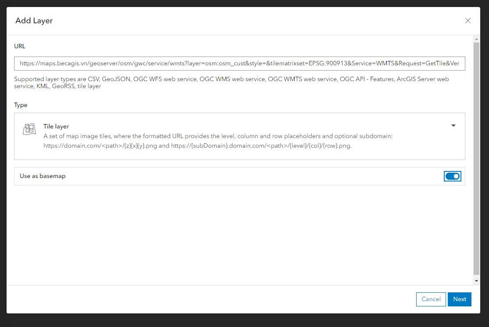

# BecaGIS Basemap

**MỤC LỤC**
<!-- TOC -->
* [BecaGIS Basemap](#becagis-basemap)
  * [Chuẩn bị dữ liệu](#chuẩn-bị-dữ-liệu)
    * [Tải dữ liệu](#tải-dữ-liệu)
    * [Tải fonts](#tải-fonts)
  * [Mô tả dữ liệu](#mô-tả-dữ-liệu)
    * [OSM](#osm)
    * [BecaGIS](#becagis)
  * [Deployment](#deployment)
    * [Đẩy dữ liệu vào PostgreSQL](#đẩy-dữ-liệu-vào-postgresql)
    * [Deploy GeoServer](#deploy-geoserver)
  * [Thiết kế style](#thiết-kế-style)
    * [Cập nhật fonts](#cập-nhật-fonts)
    * [Mô tả các mức zoom](#mô-tả-các-mức-zoom)
    * [Quy phạm địa chính trong thiết kế](#quy-phạm-địa-chính-trong-thiết-kế)
    * [Sắp xếp thứ tự các lớp](#sắp-xếp-thứ-tự-các-lớp)
    * [Thiết style theo từng lớp](#thiết-style-theo-từng-lớp)
  * [Tích hợp Basemap vô các phần mềm GIS](#tích-hợp-basemap-vô-các-phần-mềm-gis)
    * [QGIS](#qgis)
    * [ArcGIS Pro](#arcgis-pro)
    * [ArcGIS Online](#arcgis-online)
    * [Leaflet](#leaflet)
    * [MapBox GL](#mapbox-gl)
  * [Links](#links)
<!-- TOC -->

## Chuẩn bị dữ liệu

### Tải dữ liệu

Truy cập https://download.geofabrik.de để tải dữ liệu Việt Nam. Hoặc tải trực tiếp
từ [link](https://download.geofabrik.de/asia/vietnam-latest.osm.pbf)

### Tải fonts

Tải font Poppins Việt Hóa tại [link](https://drive.google.com/file/d/1rskZZkodldoVCyiS5sYJ5KjJugJKlS9_/view?usp=sharing)

## Mô tả dữ liệu

### OSM

Truy cập [link](https://wiki.openstreetmap.org/wiki/Map_features) để xem mô tả chi tiết từng lớp dữ liệu OSM

Danh sách dữ liệu OSM nạp vào CSDL

| Layer                | EPSG | Feature Type          | Mô tả                                    |
|----------------------|------|-----------------------|------------------------------------------|
| osm_admin            | 3857 | Polygon               | Các cấp hành chính                       |
| osm_amenities        | 3857 | Polygon               | Tiện nghi (quán bar, cafe, nhà hàng,...) |
| osm_barrierpoints    | 3857 | Point                 | Rào chắn                                 |
| osm_barrierways      | 3857 | Linestring            | Rào chắn                                 |
| osm_boundary         | 3857 | Linestring            | Ranh giới hành chính các cấp             |
| osm_buildings        | 3857 | Polygon               | Tòa nhà                                  |
| osm_housenumbers     | 3857 | Polygon               | Số nhà                                   |
| osm_landusages       | 3857 | Polygon               | Sử dụng đất                              |
| osm_places           | 3857 | Point                 |                                          |
| osm_roads            | 3857 | Linestring            | Đường giao thông                         |
| osm_transport_areas  | 3857 | Polygon               | Khu vực giao thông                       |
| osm_transport_points | 3857 | Point                 | Điểm giao thông                          |
| osm_waterareas       | 3857 | Polygon, MultiPolygon | Vùng thủy                                |
| osm_waterways        | 3857 | Linestring            | Đường thủy                               |

Danh sách dữ liệu OSM Low Resolution

| Layer                                 | EPSG | Feature Type | Mô tả             |
|---------------------------------------|------|--------------|-------------------|
| builtup_area                          | 3857 | Polygon      | Khu vực xây dựng  |
| icesheet_outlines                     | 3857 | Linestring   | Outline tảng băng |
| icesheet_polygons                     | 3857 | Polygon      | Vùng tảng băng    |
| land_polygons                         | 3857 | Polygon      | Vùng đất          |
| ne_10m_admin_0_boundary_lines_land    | 3857 | Linestring   | Đường ranh giới   |
| ne_10m_admin_0_countries_points       | 3857 | Point        | Vị trí quốc gia   |
| ne_10m_admin_1_states_provinces_lines | 3857 | Linestring   | Ranh giới tỉnh    |
| ne_10m_bathymetry                     | 3857 | Polygon      | Ảnh đo độ sâu     |
| ne_10m_geography_marine_polys         | 3857 | Polygon      | Vùng biển         |
| simplified_land_polygons              | 3857 | Polygon      | Vùng đất          |
| water_polygons                        | 3857 | Polygon      | Vùng biển         |

### BecaGIS

| Layer             | EPSG | Feature Type    | Mô tả                                     |
|-------------------|------|-----------------|-------------------------------------------|
| wld_admin_pt      | 4326 | Point           | Đơn vị thành chính thế giới               |
| wld_boundary      | 4326 | MultiPolygon    | Ranh giới hành chính các quốc gia         |
| wld_cities        | 4326 | Point           | Thành phố, thủ đô thế giới                |
| wld_continents_pt | 4326 | Point           | Châu lục                                  |
| wld_oceans_pt     | 4326 | Point           | Đại dương                                 |
| wld_seas_pt       | 4326 | Point           | Biển                                      |
| vn_admin_ln       | 4326 | MultiLinestring | Ranh giới hành chính Việt Nam             |
| vn_admin_pt       | 4326 | Point           | Đơn vị hành chính Việt Nam                |
| vn_boundary_mask  | 4326 | MultiPolygon    | Mask quốc gia Việt Nam                    |
| vn_islands_pt     | 4326 | Point           | Các đảo, quần đảo thuộc địa phận Việt Nam |
| vn_sea_ln         | 4326 | MultiLinestring | Đường mô tả biển Việt Nam                 |
| vn_vietnam        | 4326 | MultiPolygon    | Quốc gia Việt nam                         |

## Deployment

### Đẩy dữ liệu vào PostgreSQL

Tải dữ liệu OSM (vietnam-latest.osm.pbf) đặt tại thư mục gốc

Cấu hình biến trong file .env

- POSTGRES_DB
- POSTGRES_USER
- POSTGRES_PASS
- POSTGRES_PORT

Thực thi command:

```shell
./scripts/import.sh -i ./vietnam-latest.osm.pbf
```

### Deploy GeoServer

Tải bộ source về

```shell
git clone https://github.com/laragis/My_OSM.git
```

Tạo .env từ file .env.example

Cập nhật các biến môi trường

Chạy command: `docker compose up -d`

## Thiết kế style

### Cập nhật fonts

Truy cập Link: `http://localhost:8080/geoserver/rest/fonts.json` để kiểm tra fonts đã được thêm mới

### Mô tả các mức zoom

https://wiki.openstreetmap.org/wiki/Zoom_levels

### Quy phạm địa chính trong thiết kế

Sử dụng `Ký hiệu bản đồ địa chính tỷ lệ 1:200; 1:500; 1:1000; 1:2000; 1:5000 và 1:10 000` theo Thông tư số:
/2009/QĐ-BTNMT

### Sắp xếp thứ tự các lớp

Tạo LayerGroup để quản lý các lớp bản đồ

- osm_cust_bg
    - osm:ne_10m_bathymetry
    - osm:simplified_water_polygons
    - osm:water_polygons
    - osm:land_polygons
    - osm:simplified_land_polygons
    - osm:icesheet_polygons
    - osm:icesheet_outlines
    - osm:ne_10m_admin_1_states_provinces_lines (Removed)
    - osm:landusages
    - osm:waterareas
    - osm:waterways
    - osm:builtup_area (Removed)
    - osm:vn_boundary_mask (Added)
    - osm:osm_transport_areas
    - osm:roads
    - osm:osm_buildings
    - osm:ne_10m_admin_0_boundary_lines_land (Replaced wld_boundary)
    - osm:ne_10m_admin_0_countries_points
    - osm:osm_housenumbers
    - osm:osm_admin
    - osm:osm_places
    - osm:osm_amenities
    - osm:osm_transport_points
- osm_cust_labels
    - wld_continents_pt
    - wld_oceans_pt
    - wld_islands_pt
    - wld_admin_pt
    - wld_cities
    - osm:osm_housenumbers (Optional)
- osm_cust
    - osm_cust_bg
    - osm_cust_labels
- osm_cust_hillshade
    - osm_cust_bg
    - osm_cust_labels
    - wld_hillshade
    - vn_hillshade

### Thiết style theo từng lớp

LayerGroup: `osm_cust_bg`

| Layer                         | Style                 |
|-------------------------------|-----------------------|
| osm:ne_10m_bathymetry         | bathymetry_cust       |
| osm:simplified_water_polygons | simplified_water_cust |
| osm:water_polygons            | water_cust            |
| osm:simplified_land_polygons  | world_cust            |
| osm:land_polygons             | coast_poly_cust       |
| osm:icesheet_polygons         | icesheet              |
| osm:vn_vietnam                | vn_vietnam            |
| osm:landusages                | landusages_cust       |
| osm:waterareas                | waterareas_cust       |
| osm:waterways                 | waterways_cust        |
| osm:vn_boundary_mask          | vn_boundary_mask      |
| osm:osm_transport_areas       | transport_areas       |
| osm:roads                     | roads_cust            |
| osm:roads                     | roads_oneway          |
| osm:osm_buildings             | buildings_cust        |
| osm:wld_boundary              | wld_boundary          |
| osm:vn_admin_ln               | vn_admin_ln           |

LayerGroup: `osm_cust_labels`

| Layer                 | Style             |
|-----------------------|-------------------|
| osm:wld_continents_pt | wld_continents_pt |
| osm:wld_oceans_pt     | wld_oceans_pt     |
| osm:vn_sea_ln         | vn_sea_ln         |
| osm:vn_islands_pt     | vn_island_pt      |
| osm:wld_cities        | wld_cities        |
| osm:wld_admin_pt      | wld_admin_pt      |
| osm:vn_admin_pt       | vn_admin_pt       |

LayerGroup: `osm_cust`

| Layer               |
|---------------------|
| osm:osm_cust_bg     |
| osm:osm_cust_labels |

## Tích hợp Basemap vô các phần mềm GIS

Basemap
Url: `https://maps.becagis.vn/geoserver/osm/gwc/service/wmts?layer=osm:osm_cust&style=&tilematrixset=EPSG:900913&Service=WMTS&Request=GetTile&Version=1.0.0&Format=image/png&TileMatrix=EPSG:900913:{z}&TileCol={x}&TileRow={y}`

### QGIS

Tại Browser Panel, tại mục XYZ Tiles, Right-Click chọn New Connection


Nhập các thông tin

- Name: BecaGIS BaseMap
-
URL: `https://maps.becagis.vn/geoserver/osm/gwc/service/wmts?layer=osm:osm_cust&style=&tilematrixset=EPSG:900913&Service=WMTS&Request=GetTile&Version=1.0.0&Format=image/png&TileMatrix=EPSG:900913:{z}&TileCol={x}&TileRow={y}`

Double Click vào XYZ Tile vừa thêm để hiển thị Basemap


### ArcGIS Pro

Tại Map Tab, mục Layer, chọn Add Data > Add Data From Path


Nhập Basemap URL vào ô nhập
Path `https://maps.becagis.vn/geoserver/osm/gwc/service/wmts?layer=osm:osm_cust&style=&tilematrixset=EPSG:900913&Service=WMTS&Request=GetTile&Version=1.0.0&Format=image/png&TileMatrix=EPSG:900913:{z}&TileCol={x}&TileRow={y}`
và nhấn nút Add


Kết quả


### ArcGIS Online

Tại giao diện Map Viewer, chọn menu Layer tại SidePanel, nhấn nút mũi tên xuống cạnh nút Add, chọn Add Layer From URL


Nhập các thông tin:

-
URL: `https://maps.becagis.vn/geoserver/osm/gwc/service/wmts?layer=osm:osm_cust&style=&tilematrixset=EPSG:900913&Service=WMTS&Request=GetTile&Version=1.0.0&Format=image/png&TileMatrix=EPSG:900913:{z}&TileCol={x}&TileRow={y}`
- Type: Tile Layer
- Use as basemap: Yes



Tiếp tục nhập các thông tin và nhấn nút `Add to map`

- Title: BecaGIS Basemap
- Attribution: BecaGIS


Kết quả hiển thị


### Leaflet

```js
// Khởi tạo TileLayer
let bcg_osm = L.tileLayer('https://maps.becagis.vn/geoserver/osm/gwc/service/wmts?layer=osm:osm_cust&style=&tilematrixset=EPSG:900913&Service=WMTS&Request=GetTile&Version=1.0.0&Format=image/png&TileMatrix=EPSG:900913:{z}&TileCol={x}&TileRow={y}');

// Thêm Basemap vào bản đồ
bcg_osm.addTo(map);
```

### MapBox GL

```js
// Khởi tạo Map Instance với Basemap mặc định
const map = new mapboxgl.Map({
  container: 'map', // container ID
  style: {
    'version': 8,
    'sources': {
      'raster-tiles': {
        'type': 'raster',
        'tiles': [
            'https://maps.becagis.vn/geoserver/osm/gwc/service/wmts?layer=osm:osm_cust&style=&tilematrixset=EPSG:900913&Service=WMTS&Request=GetTile&Version=1.0.0&Format=image/png&TileMatrix=EPSG:900913:{z}&TileCol={x}&TileRow={y}'
        ],
        'tileSize': 256    
      }
    },
    'layers': [
        {
        'id': 'bcg-osm-tiles',
        'type': 'raster',
        'source': 'raster-tiles',
        'minzoom': 0,
        'maxzoom': 22
        }
    ]
  },
  center: [16.2146745,105.776367], 
  zoom: 6
});

```

## Links

- https://github.com/geosolutions-it/osm-styles
- https://github.com/kartoza/docker-osm
- https://github.com/fegyi001/osmgwc
- https://github.com/geotekne-argentina/osm-geoserver-postgis
- https://github.com/kartoza/docker-geoserver
- https://github.com/Overv/openstreetmap-tile-server
- https://github.com/geobeyond/geoserver-clustering-playground
- https://github.com/openmaptiles/import-osm